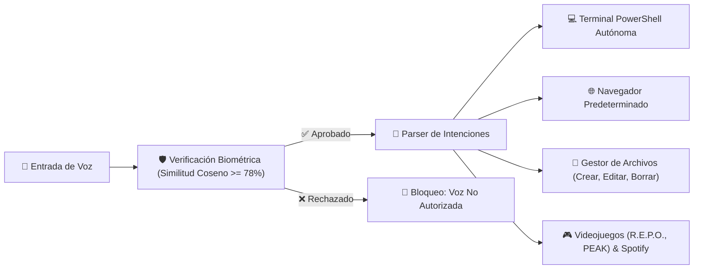

# 🎙️ VocalOS Desktop Assistant

> **Asistente Operativo de Escritorio con Biometría Vocal y Control Autónomo del SO**  
> **Titular y Autoría:** Owen Badel Hooker — Ingeniero de Sistemas  
> **Proyecto:** `PROJ-014` | **Arquitectura:** `ARQ-006` | **Diseño:** Google Stitch "Obsidian Cyber-Glass OS"

---

## 📌 Visión General
**VocalOS** es un asistente de escritorio avanzado para Windows diseñado para operar con **Zero-Trust Acústico**: procesa peticiones de voz para controlar de forma autónoma la terminal de comandos, el navegador predeterminado, el sistema de archivos y el centro de entretenimiento, pero **restringe estrictamente la ejecución a la voz biométrica de su propietario (Owen Badel Hooker)**.



---

## ✨ Características Principales

### 1. 🔐 Laboratorio de Entrenamiento y Perfil Biométrico Vocal
* **Speaker Verification:** Extracción de espectrogramas FFT, pre-énfasis y bancos espectrales normalizados (64 dimensiones) mediante `scipy.signal` y `scipy.fft`.
* **Calibración Guiada:** Grabación de 3 muestras vocales para generar el centroide acústico (Voiceprint) guardado localmente en `data/voice_profile.json`.
* **Umbral Dinámico:** Control deslizante de sensibilidad biométrica (78% por defecto).
* **Osciloscopio & VU Meter:** Visualizador en vivo de forma de onda y vúmetro de 24 segmentos (Cyan $\to$ Violeta $\to$ Rojo).

### 2. 💻 Control Autónomo de Terminal (PowerShell)
* Ejecución de comandos del sistema con streaming en tiempo real vía WebSockets hacia la consola de la UI.
* Switch de autorización autónoma para pausar o reactivar la ejecución de scripts.

### 3. 🎮 Videojuegos y Entretenimiento
* **Videojuegos Steam:** Invocación directa mediante protocolos nativos `steam://rungameid/...` para **R.E.P.O.**, **PEAK** o apertura de la biblioteca de Steam.
* **Anime & Streaming:** Búsqueda y apertura en Crunchyroll, AnimeFLV o carpetas locales de series.
* **Música (Spotify):** Control de reproducción y búsquedas mediante URI `spotify:search:...`.

### 4. 📁 Sistema de Archivos y Apertura de Carpetas por Voz
* **Apertura de Carpetas:** Detección de intenciones vocales ("abre la carpeta descargas", "abre proyectos", "abre anime") e invocación de `explorer.exe <ruta>`.
* **Operaciones CRUD:** Creación, lectura, edición (append/overwrite) y borrado de archivos por voz o interfaz gráfica.

### 5. 🎨 Interfaz de Usuario Creada con Google Stitch
* Implementación del sistema de diseño **"Obsidian Cyber-Glass OS"** generado a través de Stitch MCP.
* Paleta: Abyss Desktop `#060913`, Cyan Neón `#06b6d4`, Violeta Neón `#a855f7` con glassmorphism (`backdrop-filter: blur(24px)`).
* Tipografía: `Space Grotesk` (Titulares), `Inter` (Cuerpo), `JetBrains Mono` (Terminal y telemetría).

---

## 🛠️ Instalación y Puesta en Marcha

### Prerrequisitos
* Python 3.11 o superior.
* Windows 10/11 con PowerShell.
* Navegador moderno compatible con Web Audio API y Web Speech API (Edge, Chrome).

### Instalación de Dependencias
```bash
pip install -r requirements.txt
```

### Ejecución del Asistente
```bash
python run.py
```
El comando iniciará el servidor en `http://127.0.0.1:8000` y abrirá automáticamente la interfaz de escritorio en el navegador predeterminado.

---

## 🧪 Pruebas Automatizadas
Para ejecutar la suite de pruebas unitarias:
```bash
python -m unittest tests/test_vocalos.py
```

---

## 🗣️ Ejemplos de Comandos Vocales Soportados

| Intención | Comando Hablado de Ejemplo | Acción Ejecutada |
| :--- | :--- | :--- |
| **Videojuegos** | *"Inicia el juego R.E.P.O."* o *"Abre PEAK"* | Lanza el juego a través del cliente de Steam |
| **Carpetas** | *"Abre la carpeta descargas"* | Inicia `explorer.exe` en la carpeta Downloads |
| **Archivos (Crear)** | *"Crea el archivo notas.txt con reunión a las 5"* | Escribe el archivo en disco |
| **Archivos (Borrar)**| *"Borra el archivo notas.txt"* | Elimina el archivo tras verificación |
| **Música** | *"Pon Queen en Spotify"* | Abre Spotify con la búsqueda activa |
| **Anime** | *"Busca anime Solo Leveling"* | Abre AnimeFLV / navegador con la serie |
| **Terminal** | *"Terminal ipconfig"* | Ejecuta el comando en PowerShell con logs en vivo |
| **Búsqueda Web** | *"Busca en Google noticias de tecnología"* | Abre consulta en el navegador predeterminado |
