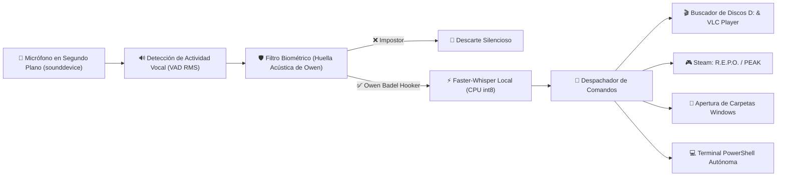

# 🎙️ VocalOS Desktop Assistant (Daemon en Segundo Plano)

> **Servicio de Voz en Segundo Plano con Biometría Vocal y Control Autónomo de Windows**  
> **Titular y Autoría:** Owen Badel Hooker — Ingeniero de Sistemas  
> **Proyecto:** `PROJ-014` | **Arquitectura:** `ARQ-006` | **Empaquetado:** Inno Setup Ready

---

## 📌 Visión General
**VocalOS Daemon** es un servicio de escritorio de Windows diseñado para operar de forma 100% silenciosa en **segundo plano (sin necesidad de navegador ni interfaz web abierta)**. Permite que el usuario esté en la cama o lejos del escritorio y le dé instrucciones directas por voz a su computadora:

* *"Reprodúceme en VLC el anime Owari no Seraph"* $\to$ Escanea los discos duros locales (especialmente `D:\Anime`), encuentra la carpeta de capítulos y lanza **VLC Media Player**.
* *"Abre la carpeta descargas"* $\to$ Abre el explorador de Windows en la ruta solicitada.
* *"Inicia el juego R.E.P.O."* o *"Abre PEAK"* $\to$ Lanza los juegos a través de Steam.
* *"Pon música en Spotify"* $\to$ Controla la reproducción y búsqueda musical.
* *"Terminal [comando]"* $\to$ Ejecuta comandos de PowerShell de forma autónoma.
* *"Crea/Edita/Borra el archivo [nombre]"* $\to$ Manipula archivos del sistema.



---

## ✨ Características Principales

### 1. 🔐 Laboratorio de Entrenamiento y Perfil Biométrico Vocal
* **Speaker Verification:** Extracción de espectrogramas FFT, pre-énfasis y bancos espectrales normalizados (64 dimensiones) mediante `scipy.signal` y `scipy.fft`.
* **Calibración Guiada:** Grabación de 3 muestras vocales para generar el centroide acústico (Voiceprint) guardado localmente en `data/voice_profile.json`.
* **Umbral Dinámico:** Control deslizante de sensibilidad biométrica (78% por defecto).
* **Osciloscopio & VU Meter:** Visualizador en vivo de forma de onda y vúmetro de 24 segmentos (Cyan $\to$ Violeta $\to$ Rojo).

### 2. 💻 Control Autónomo de Terminal (PowerShell)
* Ejecución de comandos del sistema con streaming en tiempo real vía WebSockets hacia la consola de la UI.
* Switch de autorización autónoma para pausar o reactivar la ejecución de scripts.

### 3. 🎮 Videojuegos y Entretenimiento
* **Videojuegos Steam:** Invocación directa mediante protocolos nativos `steam://rungameid/...` para **R.E.P.O.**, **PEAK** o apertura de la biblioteca de Steam.
* **Anime & Streaming:** Búsqueda y apertura en Crunchyroll, AnimeFLV o carpetas locales de series.
* **Música (Spotify):** Control de reproducción y búsquedas mediante URI `spotify:search:...`.

### 4. 📁 Sistema de Archivos y Apertura de Carpetas por Voz
* **Apertura de Carpetas:** Detección de intenciones vocales ("abre la carpeta descargas", "abre proyectos", "abre anime") e invocación de `explorer.exe <ruta>`.
* **Operaciones CRUD:** Creación, lectura, edición (append/overwrite) y borrado de archivos por voz o interfaz gráfica.

### 5. 🎨 Interfaz de Usuario Creada con Google Stitch
* Implementación del sistema de diseño **"Obsidian Cyber-Glass OS"** generado a través de Stitch MCP.
* Paleta: Abyss Desktop `#060913`, Cyan Neón `#06b6d4`, Violeta Neón `#a855f7` con glassmorphism (`backdrop-filter: blur(24px)`).
* Tipografía: `Space Grotesk` (Titulares), `Inter` (Cuerpo), `JetBrains Mono` (Terminal y telemetría).

---

## 🛠️ Puesta en Marcha en Segundo Plano
```bash
# 1. Instalar dependencias si es necesario
pip install -r requirements.txt

# 2. Ejecutar el daemon de segundo plano directamente (Modo Consola)
python vocalos_daemon.py

# O ejecutar con icono discreto en la Bandeja del Sistema (System Tray)
python vocalos_daemon.py --tray
```

### 🧪 Probar el Pipeline Completo con Audio de Prueba
```bash
python simulate_voice_command.py
```

### 📦 Compilación a Ejecutable e Instalador con Inno Setup
1. Compilar los binarios con PyInstaller:
   ```bash
   packaging\build_executable.bat
   ```
2. Compilar el instalador con Inno Setup:
   - Abrir y compilar `packaging\VocalOS_Installer.iss` en **Inno Setup Compiler**.
   - Se generará el instalador final `dist\VocalOS_Instalador_v1.0.exe` con opción de autoinicio con Windows.

---

## 🧪 Pruebas Automatizadas
Para ejecutar la suite de pruebas unitarias:
```bash
python -m unittest tests/test_vocalos.py
```

---

## 🗣️ Ejemplos de Comandos Vocales Soportados

| Intención | Comando Hablado de Ejemplo | Acción Ejecutada |
| :--- | :--- | :--- |
| **Videojuegos** | *"Inicia el juego R.E.P.O."* o *"Abre PEAK"* | Lanza el juego a través del cliente de Steam |
| **Carpetas** | *"Abre la carpeta descargas"* | Inicia `explorer.exe` en la carpeta Downloads |
| **Archivos (Crear)** | *"Crea el archivo notas.txt con reunión a las 5"* | Escribe el archivo en disco |
| **Archivos (Borrar)**| *"Borra el archivo notas.txt"* | Elimina el archivo tras verificación |
| **Música** | *"Pon Queen en Spotify"* | Abre Spotify con la búsqueda activa |
| **Anime** | *"Busca anime Solo Leveling"* | Abre AnimeFLV / navegador con la serie |
| **Terminal** | *"Terminal ipconfig"* | Ejecuta el comando en PowerShell con logs en vivo |
| **Búsqueda Web** | *"Busca en Google noticias de tecnología"* | Abre consulta en el navegador predeterminado |
